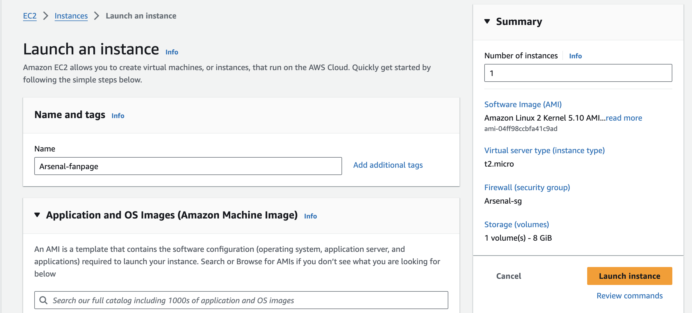
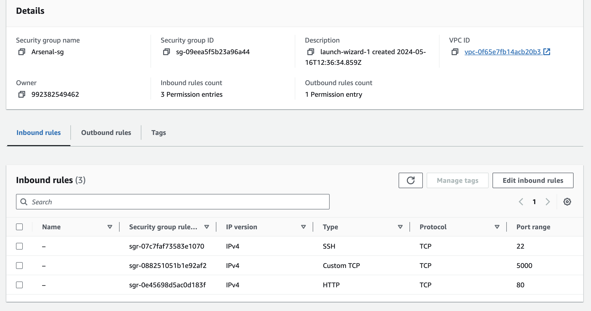
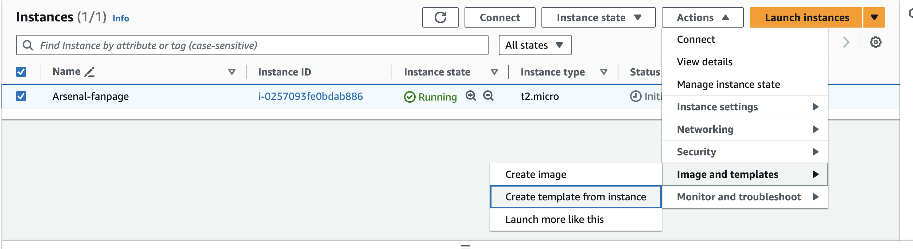

# CloudAppExercise - Eldan
## Intro
This git repo has an example flask app for user db (for Arsenal FC fans) along with a Dockerfile to make an image for the app.
The goal of the exercise is to deploy this app via docker container in an AWS EC2 instance and later on use a load balancer and auto scaling group for traffic managment. the Arsenal logo image is also used via an s3 storage object (public)

## Deployment instruction - For single EC2 instance
1. Clone the repository to the local/virtual machine with git clone (install it if missing)
2. In case you don't have docker installed, use the following manual to install Docker:
   1. for Amazon-Linux - https://medium.com/@srijaanaparthy/step-by-step-guide-to-install-docker-on-amazon-linux-machine-in-aws-a690bf44b5fe
   2. for Ubuntu - https://docs.docker.com/engine/install/ubuntu/
3. Change directory to the repo directory (where the Dockerfile is saved) and in the terminal insert the following commands:
   1. docker build -t myarsenalapp .
   2. docker run -d -p 5000:5000 myarsenalapp
4. Using the Public IP for the EC2 or localhost open an internet tab in port 5000:
  
6. The app is up!
   

## Deployment instructions - launch template and NLB

1. create an ec2 instance as previously showed (EC2 settings):
   
2. Use the following sg-rules (inbound from anywhere):
   
3. after making sure the app works properly (as done previuosly)
4. select the running app --> actions --> Images and templates --> Create template from instance
   
5. keep everything as as and scroll down to advanced settings
6. in the User Data section paste the following:
```
#!/bin/bash

sudo yum update -y

sudo yum install git -y

git clone https://github.com/eldankit/CloudAppExercise

cd ..

cd ..

cd CloudAppExercise/

sudo yum install docker -y

sudo systemctl start docker

sudo systemctl enable docker

sudo usermod -a -G docker $(whoami)

newgrp docker

docker build -t myarsenalapp .

docker run -d -p 5000:5000 myarsenalapp
```
7. create the launch template
8. go to launch templates section and select the created template, go to Actions --> launch instance from template and make sure that the app is running the same
9. go to Load Balancers and create a new network load balancer. make sure to select all the subnets and make a listener to port 80 and at the target group section click create target group.
10. at the target group select tcp protocol and select port 5000, at the healthcheck also make sure to use the tcp protocol and create the target group.
11. at the load balancer creation page refresh the target group list and select the one that you created.
